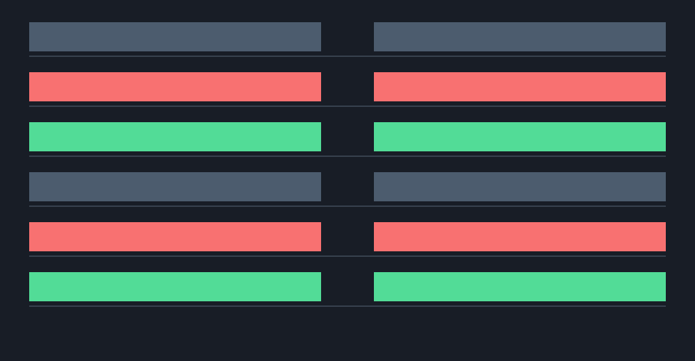

<h1 align="center">Porrima</h1>

<p align="center">
  <strong>Dependency-free line, word, and three-way diff, exact patching, and structured merge for Ruby.</strong>
</p>

<p align="center">
  <a href="https://rubygems.org/gems/porrima"></a>
  <a href="https://github.com/noxdea/porrima/actions/workflows/main.yml"></a>
  <a href="porrima.gemspec"></a>
  <a href="LICENSE.txt"></a>
</p>

<p align="center">
  <a href="https://noxdea.github.io/porrima/">Website</a> ·
  <a href="#features">Features</a> ·
  <a href="#installation">Installation</a> ·
  <a href="#quick-start">Quick start</a> ·
  <a href="#core-api">Core API</a> ·
  <a href="#cli">CLI</a>
</p>

---

Porrima turns two or three texts into structured edits, hunks, patches, and
merge conflicts. Its core performs no I/O, knows nothing about Git, and leaves
color, width, truncation, caching, and other display policy to the caller.



## Features

- Linear-space Myers diff for lines and inline word or character refinement
- Context hunks, change statistics, gutter marks, and paired rows
- Unified diff output with strict patch parsing, application, and reversal
- Three-way merge with structured conflicts, output regions, and immutable resolution
- Sparse sheet cell changes and ordered slide changes without application dependencies
- CLI output as unified text or JSON
- No runtime dependencies

## Installation

```sh
gem install porrima
```

Or add `gem "porrima"` to your Gemfile. Porrima requires CRuby 3.1 or newer.

## Quick start

```ruby
require "porrima"

before = "one\ntwo\n"
after = "one\nchanged\n"
diff = Porrima.diff(before, after, context: 1)

diff.stat.to_h
# => { insertions: 1, deletions: 1, hunks: 1 }

puts diff.to_unified(old_name: "a/example", new_name: "b/example")
```

## Core API

| API | Result |
| --- | --- |
| `Porrima.diff(before, after)` | Lazy `Diff` snapshot with every result view |
| `Porrima.edits(before, after)` | Ordered equal, deleted, and inserted lines |
| `Porrima.hunks(before, after)` | Context-aware change groups |
| `Porrima.unified(before, after)` | Unified diff text |
| `Porrima.apply(text, hunk)` | Text with one exact hunk applied |
| `Porrima.revert(text, hunk)` | Text with one exact hunk reversed |
| `Porrima::Inline.refine(before, after)` | Word- or character-level spans |
| `Porrima::Patch.parse(text)` | Parsed unified file diffs |
| `Porrima::Merge.three_way(...)` | Structured three-way merge result |
| `Porrima::Structured.sheet(before, after)` | Changed cells in row/column order |
| `Porrima::Structured.slides(before, after)` | Added, removed, or modified slide positions |

### Structured data

`Structured.sheet` accepts sparse sheets with `row_count`, `column_count`, and
`each_in(top, left, bottom, right)`, such as `Denebola::Sheet` returned by
`Rukbat::Workbook#sheet`. It returns only changed cells, with zero-based
`row` and `column`, `kind`, `before`, and `after`. A missing cell is `nil`.

`Structured.slides` accepts two ordered arrays. Pass a block to compare a
projection of each slide, while the results retain the original slide values:

```ruby
before = old_deck.slides
after = new_deck.slides
changes = Porrima::Structured.slides(before, after) do |slide|
  [slide.layout, slide.slots.transform_values(&:text), slide.notes]
end
```

Each change has `kind`, zero-based `old_index`/`new_index`, and `before`/`after`.
An absent side has a `nil` index and value. Choose a projection that includes
everything relevant to your comparison; for exact Markdown changes, compare
the decks' source text with `Porrima.diff`.

### Diff result

| View | Contains |
| --- | --- |
| `edits` | Equal, deleted, or inserted lines with old and new positions |
| `hunks` | Context-aware groups with exact old and new text |
| `stat` | Insertion, deletion, and hunk counts |
| `marks` | Added, modified, or removed ranges on the new side |
| `rows` | Old and new lines paired for side-by-side display |

Use `hunk_at(new_line:)` or `mark_at(new_line:)` for position lookup,
`to_unified` for interoperable text, and `to_h` for serialization.

`Diff` snapshots its inputs and lazily memoizes these collections. Finish the
fields needed by another thread on the producing thread before sharing it.

### Inline diff

```ruby
old_spans, new_spans = Porrima::Inline.refine("hello old", "hello new")
```

Pass `granularity: :char` to compare grapheme clusters instead of words.

### Patch

```ruby
file = Porrima::Patch.parse(diff.to_unified).first
file.applies?(before) # => true
file.apply(before)    # => "one\nchanged\n"
file.revert(after)    # => "one\ntwo\n"
```

Patch application is exact: stale or malformed input raises a Porrima error.

### Three-way merge

```ruby
merge = Porrima::Merge.three_way(
  base: "old\n",
  ours: "ours\n",
  theirs: "theirs\n"
)

merge.clean?
merge.conflicts
merge.regions # zero-based locations in merge-marker output
Porrima::Merge.to_text(merge, style: :diff3)

resolved = Porrima::Merge.resolve(merge, 0, :ours)
Porrima::Merge.to_resolved_text(resolved) # => "ours\n"
Porrima::Merge.conflict_inline(merge.conflicts.first)
```

`resolve` accepts `:ours`, `:theirs`, `:base`, `:ours_then_theirs`,
`:theirs_then_ours`, a replacement string, or an array of replacement strings.
It returns a new result and leaves the source result unchanged. Use `resolve_all`
to apply one choice to every conflict. `to_resolved_text` rejects results that
still contain a conflict.

## CLI

```text
porrima [diff] [options] OLD NEW
porrima merge [options] BASE OURS THEIRS
porrima apply [options] PATCH [FILE]
```

Diff supports unified output, `--json`, `--quiet`, and `--max-bytes`. Merge
supports structured JSON or `diff3`/`merge` markers. Apply supports
`--reverse` and validation-only `--check`.

Exit status is 0 for no diff or conflict, 1 for a diff or conflict, and 2 for
an error.

## Compatibility and limits

- Line edits, hunks, unified output, and revert behavior are byte-compatible
  with the original Canopus diff engine.
- Public struct field names and order are part of the 0.1 contract.
- Comparison uses `String#==`; callers own encoding normalization.
- Patch application intentionally has no fuzz matching.
- Inline refinement treats over 2,000 combined tokens as one replacement.
- Merge region positions are zero-based and cover the complete conflict marker
  block produced by `to_text(style: :merge)`.
- `Porrima::Budget` can replace an oversized input as one block or raise
  `Porrima::BudgetExceeded`.
- During 0.x releases, minor versions may contain breaking changes.

## Development

```sh
bundle install
bundle exec rake
ruby tools/check_isolation.rb
bundle exec rbs -I sig validate
bundle exec rake bench:assert
gem build --strict porrima.gemspec
```

## Contributing

Bug reports and pull requests are welcome on
[GitHub](https://github.com/noxdea/porrima).

## License

Porrima is available under the [MIT License](LICENSE.txt).
